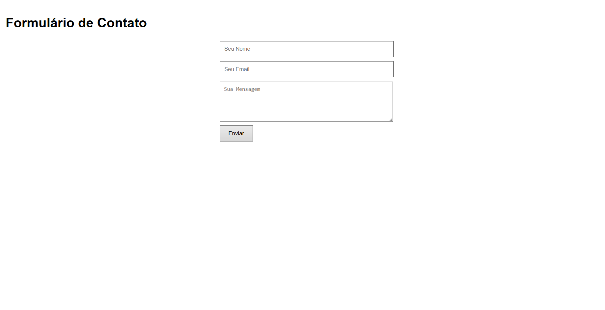

# Formulário de Contato com Flask

Este é um **formulário de contato simples** desenvolvido com **Python Flask**. Ele permite que usuários enviem nome, email e mensagem, que serão salvos em um arquivo local (`submissions.txt`).  

---

## 🚀 Funcionalidades

- Formulário com campos:
  - Nome
  - Email
  - Mensagem
- Validação básica de campos obrigatórios
- Salva envios em arquivo `.txt`
- Mensagens de sucesso ou erro para o usuário

---

## 💻 Tecnologias

- Python 3.12+
- Flask
- HTML/CSS

---

## 📂 Estrutura do Projeto

formulario_contato/
├── app.py
├── templates/
│ └── index.html
├── submissions.txt
├── requirements.txt
└── README.md

yaml
Copiar código

---

## ⚙️ Como Rodar Localmente

1. Clone o repositório:

```bash
git clone https://github.com/SeuUsuario/formulario_contato.git
cd formulario_contato
Instale as dependências:

bash
Copiar código
pip install -r requirements.txt
Execute o aplicativo:

bash
Copiar código
python app.py
Abra no navegador:

cpp
Copiar código
http://127.0.0.1:5000/
Preencha o formulário e envie.
As mensagens serão salvas em submissions.txt.

📝 Observações
Para produção, é recomendado configurar envio de emails ou banco de dados.

Este projeto é ideal para aprendizado de Flask e criação de pequenos formulários interativos.

📸 Preview



📄 Licença
Este projeto é open source. Sinta-se à vontade para usar e modificar.

yaml
Copiar código

---

Se você quiser, posso criar **uma versão do README com instruções de envio de email automático**, que deixaria o formulário funcional sem precisar abrir o `.txt`.  

Quer que eu faça isso?
